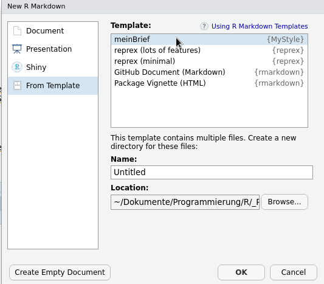

```{r setup, include=FALSE}
knitr::opts_chunk$set(echo = TRUE)
```

## Einleitung

Ich nutze `RMarkdown` und `RStudio` schon seit längerem für statistische Auswertungen und Beispielrechnungen in der Lehre. Für meine Briefe und Rechnungen habe ich immer `LaTeX` verwendet.

Im Dezember habe ich dann dieses Video von Rob Hyndman gesehen:

<https://www.youtube.com/watch?v=_D-ux3MqGug>

<https://robjhyndman.com/seminars/rmarkdown/>

...und dachte mir: das will ich auch!

## Vorwarnung

Diese Anleitung setzt voraus, dass Sie Ihre Briefe und Rechnungen bereits in `LaTeX` schreiben, bzw, dass eine Brief- oder Rechnungsvorlage in `LaTeX` vorliegt. In diesem Tutorial möchte ich zeigen, wie Sie Ihre `LaTeX`-Vorlagen als `Templates` in `RMarkdown` verfügbar machen können, um die Briefe im `PDF`-Format zu erzeugen. Das heisst, dass letztendlich Ihr `RMarkdown` wieder über `LaTeX` nach `PDF` kompiliert wird. `LaTeX` muss also installiert sein, und Sie müssen das gewünschte Layout bereits in `LaTeX` erstellt haben.

Die Überführung nach `Rmarkdown`geht am einfachsten, indem man sie als `Templates` in einem eigenen `R`-Paket abpeichert.


## Ein eigenes `R`-Paket anlegen

Klicke in `RStudio` auf `File` $\rightarrow$ `New Project...`

Wählen Sie `R Package` aus.

{width="400"}

<br>

Geben Sie dem Paket einen Namen, z.B. `MyStyle`, und klicke auf `Create Project...`

{width="400"}

<br>


Im Arbeitsverzeichnis des neuen Projekts liegen nun die notwendigen Dateien und grundlegenden Paketordner, wobei wir das meister ignorieren können.

In `DESCRIPTION` können Sie eine Beschreibung des Pakets vornehmen. Wenn Sie das Paket eh nie veröffentlichen, können Sie sich diesen Schritt sparen.

Im Verzeichnis `R` werden alle Scriptdateien automatisch ausgeführt, sobald das Paket aktiviert wird. Dort hat RStudio bereits die Dummy-Datei `hello.R` angelegt. Die dort hinterlegte Funktion `hello()` steht also nach Aktivierung des Pakets zur Verfügung.

Das können wir direkt testen, indem wir das Paket "*bauen* und *installieren*".

Klicken Sie im Datenfenster (rechter oberer Bereich) auf den Reiter `Build`.

{width="400"}

In diesem Bereich können Sie auf den Knopf `Install and Restart` klicken. 

{width="400"}

Dadurch wird Ihr neues Paket installiert und automatisch per `library(MyStyle)` geladen. Sie können nun alle Funktionen Ihres Pakets in der `R`-Konsole aufrufen. Probieren wir also die Dummy-Funktion `hello()` aus, die in der Datei `R/hello.R` hinterlegt ist:
```{r include=F}
library(MyStyle)
```

```{r}
hello()
```

Immer dann, wenn Sie dem Paket neue Funktionen (oder Templates) hinzugefügt haben, können Sie es durch Klick auf `Install and Restart` aktualisieren.


## Ein Template anlegen

Templates für` RMarkdown` müssen innerhalb des Pakets im Ordner `inst/rmardown/templates/` vorliegen.
Jedes Template erhält einen eigenen Unterordner, in welchem die erforderlichen Dateien abgelegt sind. Auch hier folgend die Dateien einer gewissen Struktur. 

Mit der Funktion `use_rmarkdown_template()` aus dem Paket `usethis` können wir das "Skelett" des neuen Templates erzeugen.
Beginnen wir mit der Briefvorlage. Das Template soll `meinBrief` heissen.
```{r eval=F}
install.packages("usethis", dependencies = T)
```
```{r eval=F}
usethis::use_rmarkdown_template(
  template_name = "meinBrief",
  template_dir = NULL,
  template_description = "Meine private Briefvorlage",
  template_create_dir = FALSE
)
```

Wie Sie sehen, wurden die Unterordner `inst/rmardown/templates/meinbrief` angelegt.
Hier liegt die Datei `template.yaml`. Sie enthält die Informationen, die wir der  `use_rmarkdown_template()`-Funktion übergeben haben.
```{yaml}
name: meinBrief
description: >
   Meine private Briefvorlage
create_dir: FALSE
```
Hier müssen wir nichts ändern.

<br>

Im Unterordner `skeleton` liegt die Datei `skeleton.Rmd`. In ihr werden Beispieltexte und -code hinterlegt, die später beim Aufruf des Templates als *Starttext* erzeugt werden. Wir benutzen diese Datei, um unser Template zu testen und die benötigten Variablen zu hinterlegen. 
Wenn wir unser Template später in `RStudio` aus den Vorlagen auswählen, dann werden alle Dateien, die im Unterorder `skeleton` liegen, in das neu erstellte Projekt kopiert.

### LaTeX Vorlage

Nehmen wir als Beispiel die folgende LaTeX-Vorlage für einen Brief.
Das Beispiel ist lauffähig, wenn Sie eine Bilddatei mit dem Namen `Unterschrift.png` im selben Verzeichnis liegen haben.

```{latex}
\documentclass[DIN,
    fontsize=11pt,          % fontsize
    paper=a4,               % page size a4
    firsthead=on,           % display header on first page
    firstfoot=on,           % display footer on first page
    pagenumber=off,         % position of the page number
    parskip=half,           % Use indent instead of skip, half, false
    enlargefirstpage=on,    % more space on first page
    fromalign=locationright, % placement of name in letter head
    addrfield=on,           % address field for envelope with window, on or true
    subject=titled,         % placement of subject, beforeopening or titled
    foldmarks=on,          % print foldmarks
    numericaldate=off,      % display date in numbers only
    KOMAold]{scrlttr2}
\usepackage[T1]{fontenc}
\usepackage[dvips]{graphicx}
\usepackage[ngerman]{babel}
\usepackage{lipsum}
\usepackage[utf8]{inputenc}
\usepackage{times}
% \usepackage{lmodern}
\usepackage{longtable}
\usepackage{booktabs}
\usepackage{lastpage}
\usepackage[rgb]{xcolor}
\usepackage{hyperref}
\hypersetup{%
    pdfborder=0 0 0,
    pdfauthor={},
    pdftitle={},
    pdfsubject={},
    pdfkeywords={},
    pdfpagemode={UseOutlines},
    bookmarksopen,
    pdfstartview={FitH},
    colorlinks,
    linkcolor={black},
    citecolor={black},
    urlcolor={blue}
  }
\urlstyle{same}

% Randbereiche mit geometry
\usepackage{geometry}
\geometry{a4paper,left=25mm,right=20mm}

\usepackage{lastpage} % letzte Seite anzeigen
\usepackage{marvosym}   
\usepackage{blindtext}

% speichere eigene Variablen für Werte, die häufig drankommen
\newcommand{\myFirstname}{Timm}
\newcommand{\myFamilyname}{Thaler}
\newcommand{\myStreet}{Absenderstr. 7}
\newcommand{\myTown}{47325 Schickensen}

% ---Angaben für das Absenderfeld--------
\setkomavar{fromname}{\flushright\normalfont\textbf{\myFirstname\ \myFamilyname}}
\setkomavar{signature}{\myFirstname\ \myFamilyname}
\setkomavar{fromaddress}{\flushright\normalfont\scriptsize%
Prof. Dr. \myFirstname\ \myFamilyname\\
\myStreet\\\myTown\\%
+49 176 555 984 66\\%
timm@thaler.de\\[2mm]
ING DiBa\\
DE06 505 165 55 5555 4312 64\\[2mm]
Aktenzeichen:\quad\ 2021-4\\
\setkomavar{date}{\today} %datum im Absenderfeld 
Datum:\quad \today}
%---------------------------------------
\renewcommand*\familydefault{\sfdefault}

% Anordnung im Absenderfeld
\setkomavar{firsthead}{}
\setkomavar{location}{%
  \raggedleft
  \usekomavar{fromname}\\
  \usekomavar{fromaddress}
}

% Absender auch über dem Empfängeradressfeld
\setkomavar{backaddress}{\myFamilyname\ | \myStreet\ | \myTown}

% signatur mit Unterschrift
\setkomavar{signature}{\includegraphics[width=25mm]{Unterschrift.png}\\\myFirstname\ \myFamilyname} 
%
% --------------kopf/fusszeile----------------
\usepackage{scrlayer-scrpage}
\clearmainofpairofpagestyles
\cfoot{\flushright\scriptsize\normalfont Seite \thepage\ von \pageref{LastPage} }
\RedeclarePageStyleAlias{empty}{scrheadings}
%----------------------------------------------
%
\setkomavar{date}{} % Datum wieder löschen
\setkomavar{subject}{Dies ist der Betreff}
\setlength{\parindent}{0pt}

% positionierung von Absender und Empfängerboxen
\makeatletter
  \@setplength{backaddrheight}{0pt}% because backaddress=off
  \@setplength{toaddrhpos}{2.5cm}%distance from left
  \@setplength{toaddrvpos}{5cm}%distance from top
  \@setplength{toaddrheight}{3.5cm}%height of the addressbox
  \@setplength{toaddrwidth}{10cm}% width of the addressbox
  \@addtoplength{locwidth}{45mm} % width of ABSENDERbox
  \@setplength{lochpos}{2cm}%distance from top
  \@setplength{locvpos}{32mm}%distance from top
  \@setplength{refvpos}{11cm}% Abstand des Haupttextes von top
\makeatother
%------------------------------------------------------------------------------------

\begin{document}
%
\begin{letter}{Andrea Empfängerin\\
Schloss Schalkenstein\\ 
Adressatenstr. 23\\
22204 Briefkasten
}
%
\opening{Sehr geehrte Frau Empfängerin,}
%
\blindtext[1]

\closing{Mit freundlichen Grüßen,
}
\end{letter}
\end{document}  

```

Die Datei erzeugt folgendes PDF:

{width="800"}

Den LaTeX-Code übertragen wir nun in unser Template. Hierfür muss im Ordner inst/markdown/templates/meinbrief der Unterordner 
`resources` angelegt werden. In diesem erzeugen wir die Datei `meinbrief.tex` und kopieren den LaTeX-Code hinein.
```{r eval=F}
file.edit("inst/markdown/templates/meinbrief/resources/meinbrief.tex")
# kopiere nun den LaTeX Code hierhin.
```
<br>

Als nächstes kopieren wir die Bilddatei für die Unterschrift in den `skeleton`-Ordner. In unserem Beispiel heisst sie `Unterschrift.png`.
{width="500"}

<br>

Ab jetzt wechseln wir immer zwischen den Dateien `skeleton.Rmd` und `meinbrief.tex` hin und her.

<br>


### `skeleton.Rmd` und `LaTeX`-Datei anpassen

Schauen wir uns zunächst die Datei `skeleton.Rmd` an.

Hier löschen wir den Beispieltext und belassen nur die Kopfzeile


```{yaml}
---
title: "Template Title"
author: "Your Name"
date: "The Date"
output: output_format
---
```

In der Kopfzeile werden Variablen vergeben. So hat z.B. Variable `title` derzeit den Wert `Template Title`,
und `date` hat den Wert `The Date`.

Wir können uns dies zu nutze machen. In unserem LaTeX-Code sind all diese Variablen referenzierbar, wenn wir ihren Namen in Dollarzeichen einrahmen, also z.B. `$title$`.

Wir gehen also in die Datei `meinbrief.tex`, und ändern dort alle *hardgecodeten* Angaben (Name, Adresse, Telefonnummer, usw) in Variablen um. Diese Variablen tragen wir ebenfalls in die Datei `skeleton.Rmd` ein und hinterlegen dort die Werte.

Die Datei `meinbrief.tex` sieht danach z.B. so aus:
```{latex}
\documentclass[DIN,
    fontsize=11pt,          % fontsize
    paper=a4,               % page size a4
    firsthead=on,           % display header on first page
    firstfoot=on,           % display footer on first page
    pagenumber=off,         % position of the page number
    parskip=half,           % Use indent instead of skip, half, false
    enlargefirstpage=on,    % more space on first page
    fromalign=locationright, % placement of name in letter head
    addrfield=on,           % address field for envelope with window, on or true
    subject=titled,         % placement of subject, beforeopening or titled
    foldmarks=on,          % print foldmarks
    numericaldate=off,      % display date in numbers only
    KOMAold]{scrlttr2}
\usepackage[T1]{fontenc}
\usepackage[dvips]{graphicx}
\usepackage[ngerman]{babel}
\usepackage{lipsum}
\usepackage[utf8]{inputenc}
\usepackage{times}
% \usepackage{lmodern}
\usepackage{longtable}
\usepackage{booktabs}
\usepackage{lastpage}
\usepackage[rgb]{xcolor}
\usepackage{hyperref}
\hypersetup{%
    pdfborder=0 0 0,
    pdfauthor={},
    pdftitle={},
    pdfsubject={},
    pdfkeywords={},
    pdfpagemode={UseOutlines},
    bookmarksopen,
    pdfstartview={FitH},
    colorlinks,
    linkcolor={black},
    citecolor={black},
    urlcolor={blue}
  }

\urlstyle{same}

% Randbereiche mit geometry
\usepackage{geometry}
\geometry{a4paper,left=25mm,right=20mm}

\usepackage{lastpage} % letzte Seite anzeigen
\usepackage{marvosym}
\usepackage{blindtext}

% speichere eigene Variablen für Werte, die häufig drankommen
\newcommand{\myFirstname}{$myFirstname$}
\newcommand{\myFamilyname}{$myFamilyname$}
\newcommand{\myStreet}{$myStreet$}
\newcommand{\myTown}{$myTown$}

% ---Angaben für das Absenderfeld--------
\setkomavar{fromname}{\flushright\normalfont\textbf{\myFirstname\ \myFamilyname}}
\setkomavar{signature}{\myFirstname\ \myFamilyname}
\setkomavar{fromaddress}{\flushright\normalfont\scriptsize%
$myGrade$ \myFirstname\ \myFamilyname\\
\myStreet\\\myTown\\%
$myTelefon$\\%
$myMail$\\[2mm]
$myBank$\\
$myIBAN$\\[2mm]
Aktenzeichen:\quad\ $myAktenzeichen$\\
\setkomavar{date}{\today} %datum im Absenderfeld
Datum:\quad \today}
%---------------------------------------
\renewcommand*\familydefault{\sfdefault}

% Anordnung im Absenderfeld
\setkomavar{firsthead}{}
\setkomavar{location}{%
  \raggedleft
  \usekomavar{fromname}\\
  \usekomavar{fromaddress}
}

% Absender auch über dem Empfängeradressfeld
\setkomavar{backaddress}{\myFamilyname\ | \myStreet\ | \myTown}

% signatur mit Unterschrift
\setkomavar{signature}{\includegraphics[width=25mm]{Unterschrift.png}\\\myFirstname\ \myFamilyname}
%
% --------------kopf/fusszeile----------------
\usepackage{scrlayer-scrpage}
\clearmainofpairofpagestyles
\cfoot{\flushright\scriptsize\normalfont Seite \thepage\ von \pageref{LastPage} }
\RedeclarePageStyleAlias{empty}{scrheadings}
%----------------------------------------------
%
\setkomavar{date}{} % Datum wieder löschen
\setkomavar{subject}{$Betreff$}
\setlength{\parindent}{0pt}

% positionierung von Absender und Empfängerboxen
\makeatletter
  \@setplength{backaddrheight}{0pt}% because backaddress=off
  \@setplength{toaddrhpos}{2.5cm}%distance from left
  \@setplength{toaddrvpos}{5cm}%distance from top
  \@setplength{toaddrheight}{3.5cm}%height of the addressbox
  \@setplength{toaddrwidth}{10cm}% width of the addressbox
  \@addtoplength{locwidth}{45mm} % width of ABSENDERbox
  \@setplength{lochpos}{2cm}%distance from top
  \@setplength{locvpos}{32mm}%distance from top
  \@setplength{refvpos}{11cm}% Abstand des Haupttextes von top
\makeatother
%------------------------------------------------------------------------------------

\begin{document}
%
\begin{letter}{$anName$\\
$anZusatz$\\
$anStrasse$\\
$anOrt$
}
%
\opening{$opening$,}
%
$body$

\closing{$closing$,
}
\end{letter}
\end{document}
```

Alle Angaben wurden durch Variablen ersetzt. Die Variable `$body$` beinhaltet den gesamten Text des Markdown-Dokuments.

In der Datei  `skeleton.Rmd` wurden die Variablen ebenfalls angelegt, und die Werte entsprechend zugeordnet:
```{yaml}
---
title: "Template Title"
author: "Your Name"
date: "The Date"
myFirstname: Timm
myFamilyname: Thaler
myStreet: Absenderstr. 7
myTown: 47325 Schickensen
myGrade: Prof. Dr.
myTelefon: +49 176 555 984 66
myMail: timm@thaler.de
myBank: ING DiBa
myIBAN: DE06 505 165 55 5555 4312 64
Betreff: Dies ist der Betreff
myAktenzeichen: 2021-4
anName: Andrea Empfängerin
anZusatz: Schloss Schalkenstein
anStrasse: Adressatenstr. 23
anOrt: 22204 Briefkasten
opening: Sehr geehrte Frau Empfängerin
closing: Mit freundlichen Grüßen
output: MyStyle::meinbrief
---

dies ist ein Testbrief, um zu schauen, ob es auch in `RMarkdown` funktioniert.


```

Als letzte Angabe im Kopfbereich wird der output auf unser Template `meinbrief` im Paket `MyStyle` gesetzt.


### Ausgabeformat bereitstellen

Jetzt sind wir fast schon fertig. Wir müssen noch das eben angegebene Ausgabeformat `meinbrief` verfügbar machen.
Hierzu erstellen wir im Paketordner "`R`" die Datei `formats.R`. Sie wird bei der Aktivierung des Paketes automatisch ausgeführt und soll das Ausgabgeformat bereitstellen.

```{r eval=F}
# erstelle Datei R/formats.R
file.edit("R/formats.R")
```

Sie erhält folgenden Inhalt:
```{r}
meinbrief <- function(...) {
  template <- system.file("rmarkdown/templates/meinbrief/resources/meinbrief.tex",
                          package="MyStyle")
  bookdown::pdf_document2(...,
                          template = template
  )
}
```


### Ausgabe kontrollieren

Jetzt können wir das Paket neu bauen und installieren indem wir
`Install and Restart` klicken. 

{width="400"}


Wenn alles korrekt eingetragen wurde, können wir nun unsere Beispieldatei `skeleton.Rmd` knitten. Das erzeugt eine PDF-Datei
im Unterordner `skeleton` (weil `skeleton.Rmd` dort liegt). Überprüfen Sie, ob alles so aussieht, wie Sie möchten. Ist alles gut, entfernen Sie die `PDF`-Datei und bauen Sie das Paket nocheinmal neu. Fertig.


## Paket als Vorlage nutzen

Ist das Paket installiert, steht das Template in RStudio zur Auswahl. Klicken Sie auf `File` $\rightarrow$ `New File`  $\rightarrow$ `RMarkdown` und wählen Sie "From Template".

{width="400"}


Dort steht nun `meinBrief` zur Auswahl. Wenn Sie auf `OK` klicken, erhalten Sie den Beispielcode aus `skeleton.Rmd` sowie die Datei `Unterschrift.png`. Wenn Sie vergessen haben, die PDF-Datei Ihrer Testreihen zu entfernen, wird diese ebenfalls erzeugt.


<br>

# Weiterführende Links

- https://bookdown.org/yihui/rmarkdown/template-structure.html

- https://www.produnis.de/R
